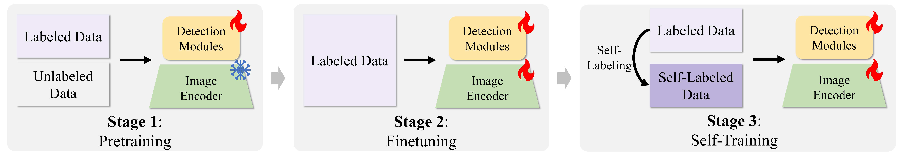

# OpenRSD: Towards Open-prompts for Object Detection in Remote Sensing Images

<div align="center">

[](https://openaccess.thecvf.com/content/ICCV2025/papers/Huang_OpenRSD_Towards_Open-prompts_for_Object_Detection_in_Remote_Sensing_Images_ICCV_2025_paper.pdf)
[](LICENSE)

</div>

## 📖 简介

欢迎来到 **OpenRSD** 的官方代码仓库！本项目提出了一种支持开放提示（open-prompts）的遥感图像目标检测方法，支持多模态提示并集成多任务检测头，以平衡单阶段或两阶段检测器的精度和实时性要求。

**本论文已被 ICCV 2025 接收。**

### 主要特性

- 🎯 **多模态提示支持**：支持文本、图像等多种模态的提示输入
- 🔄 **多种检测头**：支持对齐检测头（实时性高，支持大词汇表）和融合检测头（精度高）

## 🎨 方法概述

<div align="center">
  
  <p><b>图 1: OpenRSD 方法架构</b></p>
</div>

<div align="center">
  
  <p><b>图 2: 多阶段训练流程</b></p>
</div>

## 📋 目录

- [环境要求](#环境要求)
- [安装](#安装)
- [数据和模型](#数据和模型)
- [快速开始](#快速开始)
  - [训练](#训练)
  - [测试](#测试)
- [项目结构](#项目结构)
- [结果](#结果)
- [模型权重](#模型权重)
- [准备自己的数据集](#准备自己的数据集)
- [论文](#论文)

## 🔧 环境要求

- Python >= 3.7
- PyTorch >= 1.8.0
- CUDA >= 10.2
- mmcv-full >= 1.4.0
- mmdetection
- mmrotate
- 其他依赖见 `requirements.txt`

## 💻 安装

### 1. 克隆仓库

```bash
git clone https://github.com/floatingstarZ/OpenRSD.git
cd OpenRSD
```

### 2. 创建 conda 环境（推荐）

```bash
# 只创建环境
conda create -n openrsd python=3.8 -y
# 或者你可以使用environment.yml来同时安装所有依赖（CUDA 10.2环境）
conda env create -f environment.yml
```

### 3. 安装 PyTorch

根据您的 CUDA 版本安装对应的 PyTorch：

```bash
conda activate openrsd
# 例如 CUDA 11.1
conda install pytorch torchvision torchaudio cudatoolkit=11.1 -c pytorch
```

### 4. 安装依赖

```bash
# 安装项目
pip install -v -e .
# 或者
python setup.py develop

```

## 📦 数据和模型

### 数据集和模型权重下载

所有数据集和模型权重可通过以下链接下载：

通过网盘分享的文件：OpenRSD
链接: https://pan.baidu.com/s/1QWWZOfrjAWhEbk1eQASXVQ?pwd=usnc 提取码: usnc 
--来自百度网盘超级会员v9的分享


### 数据集组织
数据集中图像、标注的文件夹都经过了压缩。
`./BaiduPCS_Upload.py` 为该项目使用的批量上传脚本，其基本原理为：压缩 -> 上传，并保留了原始目录结构。
你可以参考改脚本写一个批量解压脚本，数据集路径为 `./data` 。

本项目中使用的数据集均从网络下载原始遥感数据，并经过切片处理获得。具体的数据处理流程和脚本可参考 `tools/data/` 目录。


## 🚀 快速开始

### 训练

#### 单 GPU 训练测试

```bash
python tools/train.py ${CONFIG_FILE} [optional arguments]
```

#### 多 GPU 训练

使用智能多 GPU 训练调度脚本，可自动检测可用 GPU 并智能分配资源：

```bash
cd EXP_CONFIG
python multi_train_any_gpu.py -k XXX -c 90
```

**参数说明：**

- `-k`: 关键词筛选，可指定一个或多个关键词来筛选需要训练的配置（例如：`-k A08 A10` 表示只训练配置名包含 A08 或 A10 的模型）
- `-c`: 起始命令计数，用于设置端口号起始值（默认 10，端口号 = 29500 + 计数）
- `-d`: 指定允许使用的 GPU ID，用逗号分隔（例如：`-d 0,1,2,3` 表示只使用 GPU 0-3，默认使用所有可用 GPU）
- `-r`: 设置 runner 类型（可选值：`det`/`cls`/`few`/`resume`，默认为 `det`）

**功能特性：**

- ✅ 自动检测 GPU 内存使用情况，智能分配可用 GPU
- ✅ 自动跳过已训练完成的模型（检查 checkpoint 文件是否存在）
- ✅ 支持多任务并行训练，自动管理 GPU 资源避免冲突
- ✅ 支持批量训练多个配置，无需手动管理

**使用示例：**

```bash
# 训练所有包含 "A08" 关键词的配置
python multi_train_any_gpu.py -k A08 -c 10

# 训练多个关键词的配置（A08 或 A10）
python multi_train_any_gpu.py -k A08 A10 -c 10

# 只使用 GPU 0-3 进行训练
python multi_train_any_gpu.py -k A08 -c 10 -d 0,1,2,3

# 继续进行训练
python multi_train_any_gpu.py -k A08 -c 10 -r resume
```


### 测试

#### 单 GPU 测试

```bash
python tools/test.py ${CONFIG_FILE} ${CHECKPOINT_FILE} [optional arguments]
```

#### 批量测试

使用批量评估脚本，可自动在多个数据集上评估不同 epoch 的模型。
你可以修改Line 206的model_info配置评估不同的模型，其中，val_using_aux=True为使用融合头，=False为使用对齐头。
```bash
cd ./M_Tools/Eval_Tools
python eval_diff_epochs.py -d 0 -e 24
```

**参数说明：**

- `-d`: 指定使用的 GPU ID（例如：`-d 0` 表示使用 GPU 0）
- `-e`: 指定要评估的 epoch 列表，可指定一个或多个（例如：`-e 24` 或 `-e 12 24 36`）

**功能特性：**

- ✅ 自动在多个遥感数据集上进行评估（DOTA2、DIOR_R、FAIR1M、SpaceNet、Xview、HRSC2016、WHU_Mix 等）
- ✅ 支持批量评估多个 epoch 的模型
- ✅ 自动保存评估结果（包括 `.pkl` 预测文件和 `.json` 评估结果）
- ✅ 支持使用辅助分支进行评估（可在脚本中配置 `val_using_aux`）

**使用示例：**

```bash
# 评估单个 epoch（第 24 个 epoch）
python eval_diff_epochs.py -d 0 -e 24

# 评估多个 epoch（第 12、24、36 个 epoch）
python eval_diff_epochs.py -d 0 -e 12 24 36

# 使用不同的 GPU
python eval_diff_epochs.py -d 1 -e 24
```

**注意事项：**

- 使用前需要在脚本中配置模型信息（`model_info`），包括：
  - `cfg_pth`: 配置文件路径
  - `cfg_name`: 配置名称（用于构建 checkpoint 路径）
  - `val_using_aux`: 使用哪个分支进行评估
- 评估结果将保存在 `./results/TEST_EVAL/` 目录下
- 每个 epoch 的评估结果会保存在独立的子目录中


### 配置文件

配置文件位于 `M_configs/` 目录下，包含：

- `Step1_A08_Large_Pretrain/`: 大规模预训练配置
- `Step2_A10_Large_Pretrain_Stage3/`: 预训练第三阶段配置
- `Step3_A12_SelfTrain/`: 自训练配置
- `Other/`: 其他配置

## 📁 项目结构

```
MMRotate_AD_Pub/
├── M_AD/                    # 主要算法实现
│   ├── models/              # 模型定义
│   │   ├── detectors/       # 检测器（Flex_Rtmdet、E_Rtmdet、Hindsight_Rtmdet 等）
│   │   ├── dense_heads/     # 检测头（Flex_Rrtmdet_head、E_Rrtmdet_head 等）
│   │   ├── backbones/       # 骨干网络（CSPNeXt、ViT、Swin 等）
│   │   ├── necks/           # 颈部网络（PAFPN、Ace_fpn 等）
│   │   ├── roi_heads/       # ROI 头（Open_standard_roi_head、Hin_Box_Prompt_head 等）
│   │   ├── layers/          # 自定义层（Transformer、DINOv2 相关层）
│   │   ├── task_modules/    # 任务模块（Assigner 等）
│   │   └── utils/           # 工具函数
│   ├── datasets/            # 数据集相关
│   │   ├── samplers/        # 数据采样器（多任务采样器等）
│   │   └── transforms/      # 数据变换
│   ├── engine/              # 训练引擎
│   │   ├── optimizers/      # 优化器
│   │   └── runner/          # 训练运行器
│   ├── evaluation/          # 评估相关
│   │   └── metrics/         # 评估指标
│   └── structures/          # 数据结构
│       └── bbox/            # 边界框相关
├── M_configs/               # 配置文件
│   ├── Step1_A08_Large_Pretrain/      # 大规模预训练配置
│   ├── Step2_A10_Large_Pretrain_Stage3/  # 预训练第三阶段配置
│   ├── Step3_A12_SelfTrain/           # 自训练配置
│   └── Other/                          # 其他配置（如 InContext 学习）
├── M_Tools/                 # 工具脚本集合
│   ├── Eval_Tools/          # 评估工具
│   │   ├── eval_diff_epochs.py        # 批量评估不同 epoch
│   │   ├── auto_eval.py              # 自动评估脚本
│   │   ├── eval_cross_data.py        # 跨数据集评估
│   │   └── eval_configs/             # 评估配置
│   └── Base_Data_infos/     # 数据集信息配置
├── EXP_CONFIG/              # 实验配置管理
│   ├── multi_train_any_gpu.py         # 多 GPU 训练调度脚本
│   ├── multi_eval_any_gpu.py         # 多 GPU 评估调度脚本
│   ├── py_cmd.py                      # 训练命令封装脚本
│   └── CONFIGS/                       # 实验配置定义
├── tools/                   # MMDetection/MMRotate 工具脚本
│   ├── train.py            # 训练脚本
│   ├── test.py             # 测试脚本
│   ├── data/               # 数据处理工具（DOTA、DIOR、FAIR1M 等数据集处理）
│   ├── analysis_tools/     # 分析工具（日志分析、结果分析等）
│   └── model_converters/   # 模型转换工具
├── mmdet/                   # MMDetection 核心代码
├── mmrotate/                # MMRotate 核心代码
├── mmyolo/                  # MMYOLO 核心代码（部分功能依赖）
├── commonlibs/              # 通用工具库
├── ctlib/                   # 自定义工具库
├── src/                     # 资源文件
│   └── images/             # 图片资源（方法示意图等）
├── requirements.txt        # Python 依赖列表
├── setup.py                # 安装脚本
├── environment.yml         # Conda 环境配置
└── README.md               # 本文件
```

**主要目录说明：**

- **M_AD/**: 核心算法实现，包含所有自定义的模型、数据集、训练引擎等
- **M_configs/**: 实验配置文件，按训练阶段组织
- **M_Tools/**: 评估和数据处理工具集合
- **EXP_CONFIG/**: 实验管理和调度脚本，支持多 GPU 自动调度
- **tools/**: MMDetection/MMRotate 框架提供的标准工具

## 📊 结果

详细的实验结果和模型权重请参考论文。主要结果包括：

- 在多个遥感数据集上的检测性能
- 不同配置下的精度和速度对比
- 消融实验结果

### 性能对比

<div align="center">
  
  <p><b>图 3: 性能对比</b></p>
</div>

## 💾 模型权重
TODO

## 📝 准备自己的数据集

如果您需要在自己的数据集上微调或测试 OpenRSD，需要按照以下步骤准备数据：

### 前置要求

1. **数据集格式**：数据集需要采用 **DOTA 格式**的标注文件
   - 每个图像对应一个 `.txt` 标注文件
   - 标注格式：`x1 y1 x2 y2 x3 y3 x4 y4 category difficult`
   - 其中 `x1 y1 ... x4 y4` 为旋转边界框的 4 个顶点坐标，`category` 为类别名称，`difficult` 为困难样本标记（0 或 1）

2. **数据集组织结构**：
   ```
   data/
   ├── your_dataset/
   │   ├── images/          # 图像文件
   │   │   ├── img1.png
   │   │   └── ...
   │   └── annfiles/         # 标注文件（DOTA格式）
   │       ├── img1.txt
   │       └── ...
   ```

### 步骤 1: 图像切片处理

由于遥感图像通常尺寸很大，需要将原始大图切分成固定大小的 patches（如 1024×1024）进行训练。

**参考脚本**：`./tools/data/` 目录下的数据处理方式

**示例**（参考 `tools/data/dota/split/`）：
```bash
# 创建切分配置文件 tools/data/your_dataset/split/split_configs/ss_train.json
# 然后执行切分
python tools/data/your_dataset/split/img_split.py \
  --base_json tools/data/your_dataset/split/split_configs/ss_train.json
```

切分后的数据将保存在指定目录，用于后续的特征提取和训练。

### 步骤 2: 准备 Visual 和 Text Prompt

OpenRSD 需要视觉提示（Visual Embeddings）和文本提示（Text Embeddings）作为支持数据。您可以参考 `./M_Tools/Data2_DIOR_R/` 目录下的完整处理流程。

#### 2.1 提取 DINOv2 Visual Embeddings

**脚本**：`Step4_Extract_DINOv2_Embeds_8_3.py`

**功能**：从所有 GT（Ground Truth）边界框中提取 DINOv2 视觉特征嵌入


**配置修改**：
```python
# 修改数据路径
data_root = './your_dataset/train_val'  # 您的数据集路径
out_dir = f'{data_root}/Step4_Extract_DINOv2_Embeds_8_3'
img_dir = f'{data_root}/images'          # 图像目录
ann_dir = f'{data_root}/annfiles'        # 标注目录

# 设置 GPU
PartID = 0  # 修改为您要使用的 GPU ID
os.environ["CUDA_VISIBLE_DEVICES"] = f'{PartID}'
```

**输出**：每个图像对应一个 `.pkl` 文件，包含：
- `cls_names`: 类别名称列表
- `rboxes`: 旋转边界框坐标
- `patch_feats`: DINOv2 特征嵌入

#### 2.2 准备分类数据集并训练分类模型

**脚本**：`Step5_1_Prepare_Classification_feats.py`

**功能**：基于提取的视觉特征构造分类数据集，用于训练分类模型以筛选高质量特征

**配置修改**：
```python
data_root = '/path/to/your_dataset/train_val'
feat_dir = f'{data_root}/Step4_Extract_DINOv2_Embeds_8_3'

# 定义您的类别列表
CLASSES = ['class1', 'class2', 'class3', ...]  # 修改为您的类别

# 每类最大采样数量
max_sample = 2000

# 训练/验证集划分比例
train_ratio = 0.5
```

**输出**：
- `train_split.txt` / `val_split.txt`: 训练/验证集划分文件
- `train_gt/` / `val_gt/`: 按类别组织的特征文件
- `categories.txt`: 类别列表文件

**训练分类模型**：
使用生成的分类数据集训练一个分类模型（如 MLP 分类器），用于后续的特征质量筛选。训练脚本需要您根据实际情况编写或修改。

#### 2.3 生成 Visual 和 Text Support Data

**脚本**：`Step5_3_Prepare_Visual_Text_DINOv2_support.py`

**功能**：生成最终的视觉和文本提示支持数据

**配置修改**：
```python
data_root = '/path/to/your_dataset/train_val'
out_support_pth = f'{data_root}/Step5_3_Prepare_Visual_Text_DINOv2_support.pkl'

# 分类模型路径（Step5_1 训练得到的模型）
classification_ckpt_pth = '/path/to/classification_model/epoch_100.pth'

# SkyCLIP 模型路径和配置
ckpt_pth = '/path/to/SkyCLIP_ViT_L14/epoch_20.pt'
model_name = 'ViT-L-14'

# 定义类别和文本提示词
classes = ['class1', 'class2', 'class3', ...]  # 您的类别列表
phrases = {
    'class1': [
        'A class1 visible in the satellite image.',
        'The aerial photo shows a class1.',
        # ... 每个类别生成 10 个不同的短语
    ],
    # ... 其他类别
}
```

**输出**：
- `Step5_3_Prepare_Visual_Text_DINOv2_support.pkl`: 包含文本和视觉提示嵌入的支持数据文件
  - `visual_embeds`: 筛选后的高质量视觉特征嵌入
  - `text_embeds`: 文本提示的 CLIP 编码特征
  - `class_names`: 类别名称列表

### 完整流程总结

```bash
# 1. 图像切片（参考 tools/data/）
python tools/data/your_dataset/split/img_split.py --base_json config.json

# 2. 提取 DINOv2 特征
python M_Tools/Data2_DIOR_R/Step4_Extract_DINOv2_Embeds_8_3.py

# 3. 准备分类数据集
python M_Tools/Data2_DIOR_R/Step5_1_Prepare_Classification_feats.py

# 4. 训练分类模型（需要您自己实现或修改现有训练脚本）

# 5. 生成最终的支持数据
python M_Tools/Data2_DIOR_R/Step5_3_Prepare_Visual_Text_DINOv2_support.py
```

### 注意事项

- ⚠️ **模型权重**：确保已下载 DINOv2 和 SkyCLIP 的预训练权重
- ⚠️ **路径配置**：所有脚本中的路径都需要根据您的实际数据集路径进行修改
- ⚠️ **类别一致性**：确保所有步骤中使用的类别列表保持一致
- 💡 **文本提示词**：建议为每个类别生成多样化的文本描述，以提高模型的泛化能力
- 💡 **特征筛选**：分类模型的置信度阈值可以根据实际情况调整，以平衡特征质量和数量

### 参考示例

完整的处理流程可以参考 `M_Tools/Data2_DIOR_R/` 目录下的脚本，该目录包含了 DIOR-R 数据集的完整处理示例。


## 📄 论文

如果您使用本代码或参考了我们的结果，请引用我们的论文：

```BibTeX
@inproceedings{huang2025openrsd,
  title={OpenRSD: Towards open-prompts for object detection in remote sensing images},
  author={Huang, Ziyue and Feng, Yongchao and Liu, Ziqi and Yang, Shuai and Liu, Qingjie and Wang, Yunhong},
  booktitle={Proceedings of the IEEE/CVF International Conference on Computer Vision},
  pages={8384--8394},
  year={2025}
}
```


## 🙏 致谢

本项目基于以下优秀的开源项目：

- [MMDetection](https://github.com/open-mmlab/mmdetection)
- [MMRotate](https://github.com/open-mmlab/mmrotate)
- [MMYOLO](https://github.com/open-mmlab/mmyolo)

感谢所有贡献者和相关工作的作者！

## ❓ 常见问题

### Q: 如何选择配置文件？

A: 根据您的训练阶段选择对应的配置文件：
- **Step1**: 大规模预训练阶段
- **Step2**: 预训练第三阶段
- **Step3**: 自训练阶段

### Q: 训练时出现 CUDA 内存不足怎么办？

A: 可以尝试以下方法：
- 减小 `batch_size`
- 减小输入图像尺寸 `img_scale`
- 使用梯度累积
- 使用更少的 GPU 数量

### Q: 如何在自己的数据集上训练？

A: 请参考以下步骤：
1. 准备数据集，格式参考 `tools/data/` 目录下的示例
2. 修改配置文件中的数据路径和类别数
3. 根据需要调整训练参数

### Q: 如何评估模型性能？

A: 使用测试脚本：
```bash
python tools/test.py ${CONFIG_FILE} ${CHECKPOINT_FILE} --eval mAP
```

## 📮 联系方式

如有问题或建议，请通过以下方式联系：

- 提交 [Issue](https://github.com/floatingstarZ/OpenRSD/issues)
- 发送邮件至项目维护者(ziyuehuang@buaa.edu.cn)

## 🔗 相关链接

- [论文链接](https://openaccess.thecvf.com/content/ICCV2025/papers/Huang_OpenRSD_Towards_Open-prompts_for_Object_Detection_in_Remote_Sensing_Images_ICCV_2025_paper.pdf)
- [MMDetection 文档](https://mmdetection.readthedocs.io/)
- [MMRotate 文档](https://mmrotate.readthedocs.io/)

---

<div align="center">
  <b>⭐ 如果这个项目对您有帮助，请给我们一个 Star！⭐</b>
</div>